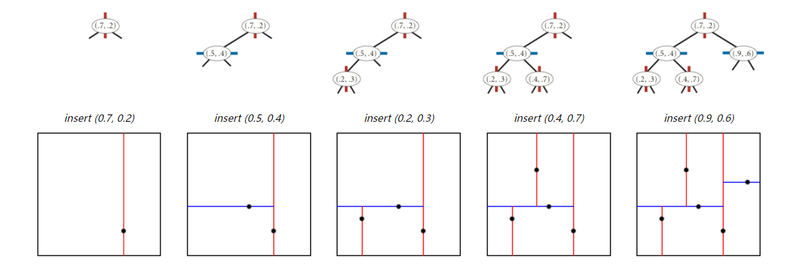
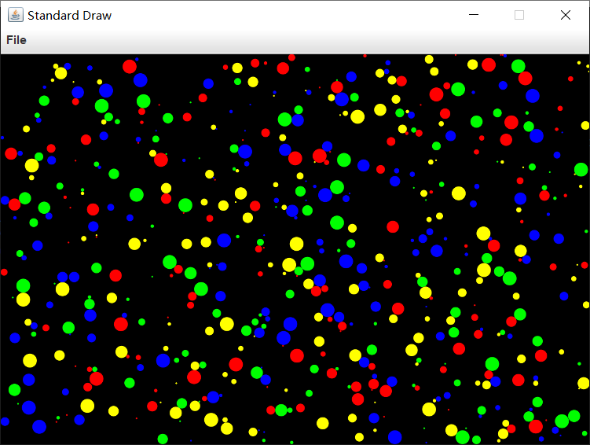

# CS203B Project - RGBY Cell Life

<font size=3>**Group Member: 丁辰辰 江轶豪 谭雍昊**  

**SID: **11912401 11912404 11910204

## Part 1 概述

在本次项目中，我们需要按照项目要求实现四色细胞的变色与移动功能，每种细胞的变色与移动均有不同，且规则明确。项目亮点为：

1. **我们分别尝试暴力解法、BH树优化算法与KD树优化算法，其中我们最后采用的KD树优化算法可以达到极高的运行效率。**

2. **在正确性测试与运行效率测试中我们的程序均能完美通过，尤其是在效率方面，我们的优化算法相比暴力解法具有巨大优势，在sample2,sample3的测试中有数百倍帧率的提升！**

3. **在程序运行上，我们采用脚本工具简化运行方式且方便老师和TA批改。**

4. **在基础部分之外，我们还实现了几个Bonus：**

   **A. 自行创建了数据集，并且有有趣的图案。**

   **B. 可以随机产生数据并输入，让您享受真正的乐趣！**

   **C. 随机更改细胞颜色**

   **D. 删除细胞功能。**

我们项目的github地址为https://github.com/Stream-neverback/Cell_Project，其中还附有项目展示的视频，包括基本功能与额外功能，欢迎star！本项目在JDK8以上环境均可运行。

**此处列出程序运行方法**：

在项目根目录下，相对位置`./script/`下存储了运行的脚本与samples。其中脚本`run.bat`是基础运行脚本，老师可以运行此脚本来进行测试，所有可配置参数如下表所示：

| 参数名称              | 解释                                                         |
| --------------------- | ------------------------------------------------------------ |
| --terminal / --gui    | 程序将在命令行/GUI模式下运行，默认为GUI模式                  |
| benchmark             | 程序将全速运行，否则将会限制每秒不超过15帧，即切合项目要求   |
| brute                 | 使用暴力解法，否则使用KD树优化算法                           |
| showFrameRate         | 是否在terminal模式下也输出帧率（默认不输出，方便批改）       |
| playerModeRandomGen   | Bonus玩法一：随机生成合格数据并输入，画板大小、细胞信息均随机 |
| playerModeChangeColor | Bonus玩法二：点击细胞可以随机更换颜色                        |
| playerModeDelete      | Bonus玩法三：点击细胞可以删除                                |

运行方式十分简单，直接将输入文件拖动到bat文件即可。运行后可以通过`compare.bat`进行结果对比，如果希望查看程序输出的txt（当然也会在命令行直接输出结果），可以到根目录下`./result/result.txt`下查看。还有三个脚本为`playerModeRandomGen.bat`直接使用即为玩法一，`playerModeChangeColor.bat`直接使用即为玩法二，`playerModeDelete.bat`直接使用即为玩法三。我们尽可能方便老师与SA的批改，如有不便请多原谅，谢谢！

## Part 2 Cell类

Cell类集中了对Cell属性定义和操作与动态性相关的构造和方法

```java
public class Cell implements Comparable<Cell>
```

其中Cell类里定义了包括了有

##### （1）静态变量：

```java
static double wall_width = 0; // x-direction 墙宽
static double wall_length = 0; // y-direction 墙长
static double dt = 1.0 / 15.0; // dt
static double delta = 1.0 / 15.0; // 运动一次的距离
static int total_num = 0; // 细胞总数，随着细胞插入不断递增
// 与颜色相关，将颜色Color类一一映射为int，适用于switch()函数
static final int RED = 0;
static final int GREEN = 1;
static final int BLUE = 2;
static final int YELLOW = 3;
```

##### （2）普通变量:

普通变量定义了包括细胞ID、细胞半径、实时位置、未来预测位置、颜色、允许运动标识符、感知范围以及感知范围内各类颜色个数等属性：

```java
    private double red_num = 0; // 感知范围内红色个数
    private double green_num = 0; // 感知范围内绿色个数
    private double blue_num = 0; // 感知范围内蓝色个数
    private double yellow_num = 0; // 感知范围内黄色个数
    public int id; // 细胞ID，数值上等于插入细胞时的总数，用后续区分是否为同一个细胞
    private final double radius; // 细胞半径
    private double pos_x; // 细胞x坐标
    private double pos_y; // 细胞y坐标
    private double future_pos_x; // 细胞未来预测x坐标（无遮挡物）
    private double future_pos_y; // 细胞未来预测y坐标（无遮挡物）
    public boolean MOVE = true; // 是否允许正常运动（即是否不需考虑有无物体遮挡的运动）
    private int color_index; // 颜色序号，即颜色Color类的映射
    private Color color; // 颜色
    double perception_r; // 感知范围

```

##### （3）细胞Cell类和墙的构造

```java
public Cell(double radius, double position_x, double position_y, Color color, double perception_radius) 
public Cell(Color color)
public Cell() 
```

##### （4）墙的构造

```java
public static void initWall(double wX, double wY)
```

##### （5）常规方法

###### i. 通用方法

细胞距离计算，包括未来预期距离（用于运动判断）

```java
public double distanceTo(Cell other)
public double x_distanceTo(Cell other)
public double y_distanceTo(Cell other)
public double future_distanceTo(Cell other)
public double distanceSquaredTo(Cell that)
```

细胞属性的返回和其他基本操作

```java
public void draw() // 绘制细胞
public double getX()
public double getY()
public double getRadius()
public double getPerception_r()
public Color getColor()
```

###### ii. 关于细胞运动的方法

关于细胞的正常运动（*MOVE = true*），下方代码以红色细胞为例，需要判断该红色细胞的运动标识符*MOVE = true*，并且确保下一步的运动不会撞到墙上，如果会撞到墙上，则运动到贴近墙边。

```java
 public void move(){
 switch (this.color_index) {
     case RED:
     if (this.pos_y + delta < wall_length - this.radius && this.MOVE) {
		this.pos_y = this.pos_y + delta;
	} else if (this.pos_y + delta >= wall_length - this.radius && this.MOVE) {
		this.pos_y = wall_length - this.radius;
		}
	 ...
	break;
 ...
 }
```

该方法并非实际上使得细胞发生运动，而是赋给*future_pos_x*或*future_pos_y*值，用于后续判断是否会碰撞接触

```java
public void future_move()
```

判断细胞**是否即将与其他细胞**发生接触，与*future_distanceTo(Cell other)*搭配使用：

```java
public boolean Cell_Overlap(Cell other)
```

返回细胞即将与其他一个会发生碰撞的细胞所需运动的距离，可用几何学方法求得数学解，与老师上课所提方法一致，因此不再赘述：

```java
public double unitDistanceUntilContact(Cell cell)
```

区别于正常运动*move()*，该方法会使细胞运动一个小于1/15的距离直到与其他一个细胞发生接触：

```java
public void moveUntilContact(Cell cell)
```

判断细胞是否会出界

```java
public boolean isOut()
```

###### iii. 关于细胞颜色检测的方法

对于探测范围内不同细胞的颜色，感知到之后需要进行统计（下方代码以感知到*cell*为红色为例）：

```java
public void add_num(Cell cell) {
	switch (cell.getColorIndex()) {
		case RED:
		this.red_num += 1;
		break;
		...
	}
}
```

根据项目要求，对细胞颜色进行逻辑判断，并根据规则进行颜色变化（以红色细胞判断逻辑为例）：

```java
 public void check_color() {
	double sum_num = this.red_num + this.blue_num + this.green_num + this.yellow_num;
	// check red
    if (this.color == Color.RED) {
		if (this.red_num >= 3 && this.red_num / sum_num > 0.7) {
			this.color = Color.GREEN;
            this.color_index = GREEN;
            this.MOVE = true;
		} else if (this.yellow_num >= 1 && this.yellow_num / (sum_num) < 0.1) {
			this.color = Color.YELLOW;
            this.color_index = YELLOW;
            this.MOVE = true;
            }
	}
	...
 }
```

###### iv. 与BHTree相关

判断细胞是否在BHTree的（东北、东南、西南或西北）树内：

```java
public boolean in(QuadNode q) {
	return q.contains(this.pos_x, this.pos_y);
}
```

###### v. 与KdTree相关

判断细胞是否在Kdtree划定的矩形区域内，用于颜色检测：

```java
public boolean in(QuadNode q) {
	return q.contains(this.pos_x, this.pos_y);
}
```


## Part 3 Cell Set （暴力解法）

暴力解法是我们首先尝试的方法，故此仅简单描述实现过程。“暴力树”为CellSET,位于src/proj/kdtree内。实现方式为将所有细胞都加入到一个SET中。

检测细胞过程中，同样采用range()方法，但是遍历的方法为直接遍历整个SET，并且把符合要求的细胞加入到一个Stack中。

```java
public Iterable<Cell> range(RectHV rect) {
    if (rect == null) throw new java.lang.NullPointerException(
            "called range() with a null RectHV");

    // Touch each point to see whether the given rect contains it.
    Stack<Cell> ans = new Stack<>();
    for (Cell p: rb) {
        if (rect.contains(p)) ans.push(p);
    }
    return ans;
}
```

检测碰撞与变色方法将会在KD树优化方法中提及。

## Part 4 BH Tree优化算法

与BHtree相关的代码文件位于bhtree文件夹内，包括BHTree.java和QuadNode.java

对于BHTree类，定义以下属性：

```java
private Cell cell;
private final QuadNode qNode;
private BHTree nwChild;
private BHTree neChild;
private BHTree swChild;
private BHTree seChild;
```

并进行BHTree的构造

```java
public BHTree(QuadNode q) {
	this.qNode = q;
    this.cell = null;
    this.nwChild = null;
    this.neChild = null;
    this.swChild = null;
    this.seChild = null;
}
```

我们可以将BHTree理解为一个四叉树，每一个节点都有一个细胞

对于每一个节点，即QuadNode类，定义有：

```java
private final double x_center;
private final double y_center;
private final double length_x;
private final double length_y;
```

从一个矩形开始，每插入一个细胞，实现将一个矩形不断地四等分的数据结构，如果没有子树，则建立子树，再进行插入，插入规则取决于细胞所处的位置和QuadNode的位置与矩形范围：

```java
public void insert(Cell cell) {
	if (this.qNode.contains(cell.getX(), cell.getY())) {
		if (this.cell == null) {
			this.cell = cell;
			return;
         }
    if (!hasNoLeaf()) { // have subtrees internal node
        insertChild(cell);
    } else { // external node
        this.createSubTrees();
        insertChild(cell);
    	}
    }
    else{
        StdOut.println("Warning: Cell is out of BHTree!");
        }
}

private void insertChild(Cell b) {
    if (b.in(nwChild.qNode))
        nwChild.insert(b);
    else if (b.in(neChild.qNode))
        neChild.insert(b);
    else if (b.in(seChild.qNode))
        seChild.insert(b);
    else if (b.in(swChild.qNode))
        swChild.insert(b);
}

public void createSubTrees() {
    this.nwChild = new BHTree(qNode.NW_Q());
    this.neChild = new BHTree(qNode.NE_Q());
    this.swChild= new BHTree(qNode.SW_Q());
    this.seChild = new BHTree(qNode.SE_Q());
}

private boolean hasNoLeaf() {
    return (nwChild == null && neChild == null && swChild == null && seChild == null);
}
```

后续关于该类数据结构在运动和颜色的判断，我们只需要根据圆或矩形筛选出在范围内的QuadNode，从而筛选出QuadNode内的细胞进行判断，这样就可以省去了遍历所消耗的复杂度O(N^2)。但由于BHTree在各种样本的测试中并**不会显著优于**暴力解法，故略去相关说明，只提供对应方法：

```java
package proj.bhtree
public void checkCollision(Cell cell)
public void checkDetection(Cell cell) 
```

## Part 5 KD Tree优化算法

KD-Tree是一种对k维空间中的实例点进行存储以便对其进行快速检索的树形结构，主要应用于多维[空间](https://baike.baidu.com/item/空间/55280)关键数据的搜索（如：范围搜索和最近邻搜索）。本项目设计了2D-Tree以处理2D平面内的Cell之间的空间关系搜索。其中，2D-Tree最关键的部分是对于节点的插入和搜索。如下图：



为了实现这种形式的插入，每个节点都具有其 左/下子树以及右上子树并且包含其对应的与坐标轴平行的相关矩形。在插入的过程中通过奇偶层确定该层对X或Y进行划分。如果选择按照x轴划分，所有x值小于指定值的节点都会出现在左子树，所有x值大于指定值的节点都会出现在右子树。如果选择按照y轴划分，所有y值小于指定值的节点都会出现在下子树，所有y值大于指定值的节点都会出现在上子树。在搜索的过程中，我们通过与节点相关的矩形与我们选择的矩形框是否重合或者点坐标是否包含在我们所选择的矩形框中来确定对应的Cell在我们需要的范围内。

Node 的定义如下：

```java
    private static class Node {

        // the point
        private final Cell p;

        // the axis-aligned rectangle corresponding to this node
        private final RectHV rect;

        // the left/bottom subtree
        private Node lb;

        // the right/top subtree
        private Node rt;

        private Node(Cell p, double[] coords) {
            this.p = p;
            rect = new RectHV(coords[0], coords[1], coords[2], coords[3]);
        }
    }
```

insert方法的实现如下

```java
    public void insert(Cell p) {
        if (p == null) throw new java.lang.NullPointerException(
                "called insert() with a null Cell");

        // new double[] {x_min, y_min, x_max, y_max)
        root = insert(root, p, true, new double[]{rangeXMin, rangeYMin, rangeXMax, rangeYMax});
    }

    private Node insert(Node n, Cell p, boolean evenLevel, double[] coords) {
        if (n == null) {
            size++;
            return new Node(p, coords);
        }

        double cmp = comparePoints(p, n, evenLevel);


        // Handle Nodes which should be inserted to the left
        if (cmp < 0 && evenLevel) {
            coords[2] = n.p.getX(); // lessen x_max
            n.lb = insert(n.lb, p, !evenLevel, coords);
        }

        // Handle Nodes which should be inserted to the bottom
        else if (cmp < 0 && !evenLevel) {
            coords[3] = n.p.getY(); // lessen y_max
            n.lb = insert(n.lb, p, !evenLevel, coords);
        }

        // Handle Nodes which should be inserted to the right
        else if (cmp > 0 && evenLevel) {
            coords[0] = n.p.getX(); // increase x_min
            n.rt = insert(n.rt, p, !evenLevel, coords);
        }

        // Handle Nodes which should be inserted to the top
        else if (cmp > 0 && !evenLevel) {
            coords[1] = n.p.getY(); // increase y_min
            n.rt = insert(n.rt, p, !evenLevel, coords);
        } else if (!n.p.equals(p))
            n.rt = insert(n.rt, p, !evenLevel, coords);


        return n;
    }
```

range （查找选定矩形框内包含的Cell）实现如下

```java
public Iterable<Cell> range(RectHV rect) {
    if (rect == null) throw new java.lang.NullPointerException(
            "called range() with a null RectHV");

    Stack<Cell> points = new Stack<>();

    // Handle KdTree without a root node yet
    if (root == null) return points;

    Stack<Node> nodes = new Stack<>();
    nodes.push(root);
    while (!nodes.isEmpty()) {

        // Examine the next Node
        Node tmp = nodes.pop();

        // Add contained points to our points stack
        if (rect.contains(tmp.p)) points.push(tmp.p);

        if (tmp.lb != null && rect.intersects(tmp.lb.rect)) {
            nodes.push(tmp.lb);
        }
        if (tmp.rt != null && rect.intersects(tmp.rt.rect)) {
            nodes.push(tmp.rt);
        }
    }
    return points;
}
```

对此，我们可以实现对感知域范围内Cell的搜索。值得注意的是，我们搜索的对象为Cell的圆心坐标，在搜索的过程中，题目给定的实际范围应当是一个圆顶点正方形，其中圆顶点的半径为被检测Cell的半径。为了方便实现，我们将搜索的过程分为两步进行。我们首先确定所有小球中的最大半径。每个Cell的搜索范围是其感知加上最大Cell的半径。在获得在这个矩形范围内的Cell后，我们再通过上述的原则对Cell进行一一甄别，确定其在感知范围内。而后我们可以进行对应的变色操作。

Cell变色感知的代码如下

```java
    public void checkDetection(Cell cell) {//隐患 若x,y超出边界可能有问题

        double xminOrg = cell.getX() - cell.getPerception_r();
        double xmaxOrg = cell.getX() + cell.getPerception_r();
        double yminOrg = cell.getY() - cell.getPerception_r();
        double ymaxOrg = cell.getY() + cell.getPerception_r();

        double xmin = cell.getX() - cell.getPerception_r() - largestRadius;
        double xmax = cell.getX() + cell.getPerception_r() + largestRadius;
        double ymin = cell.getY() - cell.getPerception_r() - largestRadius;
        double ymax = cell.getY() + cell.getPerception_r() + largestRadius;

        Iterable<Cell> cellsInRange = this.range(new RectHV(xmin, ymin, xmax, ymax));
        ArrayList<Cell> cellArrayList = new ArrayList<>();
        if (cellsInRange != null) {
            for (Cell cell1 : cellsInRange) {
                if (cell.id != cell1.id) {
                    if (cell1.in(xminOrg-cell1.getRadius(), yminOrg, xmaxOrg+cell1.getRadius(), ymaxOrg) || cell1.in(xminOrg, yminOrg-cell1.getRadius(), xmaxOrg, ymaxOrg+cell1.getRadius()) || cell1.nearToCorner(xminOrg, yminOrg, xmaxOrg, ymaxOrg)) {
                        cell.add_num(cell1);
                        cellArrayList.add(cell1);
                    }
                }
            }
        }
    }
```


碰撞的检测思路与感知变色的思路相似。首先我们确定一个即将可能发生碰撞的范围。特别的是，为了避免巨大Cell与小Cell相撞，我们检测范围考虑了最大半径的影响。在本项目中，tree的更新在每次cell遍历结束后进行，那么在实际求解过程中对于检查范围的确认需要增加最大1/15的运动距离。实际上为了确保框定的准确性，这里我们将感知范围定为一定时间的可能运动距离加上3倍的Cell最大半径。

而后，我们对每一个可能碰撞的小球进行碰撞运算，在将来能够发生碰撞的情况里确定可以允许的最大正向运动距离（即发生碰撞所需的最小运动距离）。而后使碰撞的小球相贴。

```java
    public void checkCollision(Cell cell) {
        cell.setMoveMode(true);
        double xmin = cell.getX() - collisionRange - largestRadius;
        double xmax = cell.getX() + collisionRange + largestRadius;
        double ymin = cell.getY() - collisionRange - largestRadius;
        double ymax = cell.getY() + collisionRange + largestRadius;
//        System.out.println(collisionRange+largestRadius);
//        RectHV checkRect = cell.getForwardRect(collisionRange+largestRadius);
        Iterable<Cell> cellsInRange = this.range(new RectHV(xmin, ymin, xmax, ymax));
        ArrayList<Cell> cellsListOverlap = new ArrayList<>();
        if (cellsInRange == null) {
            return;
        }
        for (Cell cell1 : cellsInRange) {
            if (cell.id != cell1.id) {
                cellsListOverlap.add(cell1);
            }
        }
        if (cellsListOverlap.size() == 0) {
            return;
        }
        ArrayList<Double> distanceList = new ArrayList<>();
        ArrayList<Cell> cellInDirection = new ArrayList<>();
        for (Cell cell2 : cellsListOverlap) {
            double distance = cell.unitDistanceUntilContact(cell2);
            if(distance>=-0.00001){
                distanceList.add(distance);
                cellInDirection.add(cell2);
            }
        }
        if(cellInDirection.size()==0){
            return;
        }
        Cell cellMinDistance = cellInDirection.get(distanceList.indexOf(Collections.min(distanceList)));
//        System.out.println(cell.getY() + " go to " + cellMinDistance.getY());
        cell.setMoveMode(false);
        cellMinDistance.setMoveMode(false);
        if (cell.id != cellMinDistance.id && Collections.min(distanceList)<1.0/15) {
            cell.moveUntilContact(cellMinDistance);
            return;
        }
        cell.setMoveMode(true);
        cellMinDistance.setMoveMode(true);

    }
```

## Part 6 仿真系统

仿真系统实际上由Console与SimulationSystem两个类构成，都位于src/proj目录下。

#### A. Console类

Console类用于读取来自于外部的细胞信息与输出要求信息，并且初始化细胞，并且为SimulationSystem类传递信息。代码逻辑为在循环中使用Scanner来读取输入信息，并且实例化细胞类，如果为命令行模式，则会把需要输出的细胞信息按顺序添加到队列中，以供后面使用。

```java
public Console(String mode) {
    Scanner input = new Scanner(System.in);
    double range_x = input.nextInt();
    double range_y = input.nextInt();
    this.range = new double[]{0, range_x, 0, range_y};
    int count = input.nextInt();
    cells = new Cell[count];
    maxR = 0.0;
    for (int i = 0; i < count; i++) {
        double x = input.nextDouble(); // input coordinate x of the cell
        double y = input.nextDouble(); // input coordinate y of the cell
        double r = input.nextDouble(); // input radius of the cell
        double p = input.nextDouble(); // input perception range of the cell
        if (maxR <= r) maxR = r;
        String c = input.next(); // input color of the cell
        Color color = c.equals("r") ? Color.RED : c.equals("g") ? Color.GREEN : c.equals("b") ? Color.BLUE : Color.YELLOW; // judge colors
        Cell.initWall(range_x, range_y);
        Cell cell = new Cell(r, x, y, color, p); // initialize cell
        cells[i] = cell; // add the cell into array
    }
    terminalMode = !mode.equals("gui"); // default is gui
    if (terminalMode) { // only terminal mode should input query
        int n = input.nextInt();
        for (int i = 0; i < n; i++) {
            double time = input.nextDouble(); // time
            int idx = input.nextInt(); // cell index
            this.queue.add(new Pair<>(time, idx));
        }
        queue = queue.stream().sorted().collect(Collectors.toList());
    }
    input.close();
}
```

#### B. SimulationSystem类

该类由时间控制循环，数据结构例化，细胞活动流程处理与画图功能等模块组成。

由于代码过于冗长，此处仅列出工作流程供参考：

##### 1. 读取来自Console初始化完毕的细胞数组与命令参数如是否采用GUI模式，benchmark模式等。

##### 2. 以GUI模式为例，设定画板大小。

##### 3. 画出细胞位置与颜色。

##### 4. 开始计时，例化KD树并且往树中插入细胞。

##### 5. 检测碰撞并移动细胞。

##### 6. 检测细胞周围颜色情况并变色。

##### 7. 若开启玩法，则完成玩法。

##### 8. 结束计时，输出实时帧率。

## Part 7 评估

按照项目文档要求，我们将会对数据准确度进行测试，同时还会对运行效率进行测试。测试方法已在报告开头表明。

#### A. 数据准确度测试

| 测试集  | 错误项数 | 测试项数 | 错误率 |
| ------- | -------- | -------- | ------ |
| Sample1 | 0        | 3        | 0.0%   |
| Sample2 | 0        | 500      | 0.0%   |
| Sample3 | 0        | 500      | 0.0%   |
| Sample4 | 0        | 30000    | 0.0%   |
| Sample5 | 0        | 63540    | 0.0%   |

注：Sample4和Sample5是最新上传到sakai上的sample2与sample3，其内只包含第一秒内的运行结果。测试按照老师要求，误差在5%以内算正确。下附部分测试代码：

```java
int wrong_cnt = 0; // count how many wrongs are there
int total_cnt = 0;
while (true) {
    total_cnt++;
    double res_x;
    try {
        res_x = input1.nextDouble();
    } catch (
        NoSuchElementException e) {
        //                e.printStackTrace();
        break;
    }
    double res_y = input1.nextDouble();
    String res_c = input1.next();
    double ans_x = input2.nextDouble();
    double ans_y = input2.nextDouble();
    String ans_c = input2.next();
    boolean compare_0 = Math.abs(res_x - ans_x) / ans_x < 0.05; // 误差在5%内即可接受
    boolean compare_1 = Math.abs(res_y - ans_y) / ans_y < 0.05;
    if (!compare_0 || !compare_1 || !res_c.equals(ans_c)) {
        System.out.println(total_cnt + " is wrong!");
        System.out.println("wrong! answer is: " + ans_x + " " + ans_y + " " + ans_c);
        System.out.println("your answer is: " + res_x + " " + res_y + " " + res_c);
        wrong_cnt++;
    }
}
System.out.println("Total wrongs: " + wrong_cnt + ", ratio: " + wrong_cnt / (double) total_cnt);
```

在Terminal模式下使用`run.bat`运行程序，并且使用`compare.bat`脚本进行结果对比，结果如上表格所示，输出结果与正确结果完全一致。

据此，数据准确度测试完美通过。

#### B. 运行效率测试

针对运行效率的测试，我们选取的指标为每秒帧数，即每秒帧数越大越好，则运行参数选择`benchmark`放开帧率限制。同时，测试环境应为细胞未稳定前的状态。测试电脑配置为英特尔8代i5笔记本芯片（测试过程中请勿限制CPU功耗并检查CPU占用情况以保证测试结果正常）。

| 测试集  | 运行模式 | 平均帧率 |
| ------- | -------- | -------- |
| Sample1 | GUI      | 178.1    |
| Sample1 | Terminal | 6232.4   |
| Sample2 | GUI      | 29.6     |
| Sample2 | Terminal | 128.7    |
| Sample3 | GUI      | 27.1     |
| Sample3 | Terminal | 87.4     |

测试结果如上表格所示。在Terminal模式下，所有测试集下运行效率都远大于要求的每秒15帧，而GUI模式下，仍然能达到要求的两倍左右效率。

由于我们的项目也实现了暴力解法，下表对比了暴力解法与优化解法的提升效果，测试均采用terminal模式进行。

| 测试集  | 面积      | 细胞个数 | 解法        | 平均帧率 | 提升    |
| ------- | --------- | -------- | ----------- | -------- | ------- |
| Sample2 | 80X100    | 2000     | Brute Force | 15.76    | \       |
| Sample2 | 80X100    | 2000     | KD Tree     | 128.7    | 816.7%  |
| Sample3 | 4000X3000 | 4085     | Brute Force | 1.42     | \       |
| Sample3 | 4000X3000 | 4085     | KD Tree     | 87.4     | 6154.9% |

通过数据对比可知，我们的优化方法为程序运行效率带来了巨大的提升，而且随着细胞活动面积和细胞个数增大，优势将会越来越大。

据此，运行效率测试完美通过。

## Part 8 额外工作

在实现基本功能正确无误的前提下，我们还发挥想象力，创造出两种特殊的模式。模式的展示也附在项目文件中的展示视频中，欢迎尝试！注，使用`sample2`测试效果最好，因为`sample1`细胞个数太少，`sample3`画板太大难以看出区别。

#### A. 完全随机产生更多samples

脚本存放于`./script/`目录下，名为`playerModeRandomGen.bat`运行可以随机产生数据并在GUI模式下运行，画板大小、细胞个数、细胞颜色等均为随机，且产生的数据必定符合规格，即不会出现细胞重叠或出界的情况，而且程序内也在一定规律内控制细胞的个数，使其能够呈现出真正细胞运动的一丝感觉。



比如上图就是随机产生的一个数据集，细胞分布均匀且填充率合理，能呈现出细胞运动的美妙之处。

#### B. 可以随机产生数据集

使用存放于`./script/`目录下的`playerModeRandomGen.bat`，即可随机产生合格数据并输入，且画板大小、细胞数量、细胞位置、颜色等全部随机！

#### C. 随机更改颜色模式

在此模式下，点击图中的细胞可以将其颜色随机改变为四种颜色中的另一种。

#### D. 点击删除细胞模式

在此模式下，点击图中的细胞会将其删除，比如`sample2`中随机删除细胞后，可以使得原本阻塞的通道打开，使细胞能够移动，十分有趣。

## Part 9 遇到的问题与解决方案

##### （1）细胞出现大量越界和细胞之间的重合

###### 解决方案：

A. 注意在运动之前确认好运动标识符*MOVE*以及越界条件确认，不仅仅是*move()*函数，对于*moveUntilContact()*也要做好确认。

B. 有相当一部分细胞并未在碰撞检测的范围，原因在于Kdtree只能检测点即圆心，而不能检测圆上任意一点（within the cell）是否在检测范围内，故需要将检测范围扩大至原来检测范围 + 细胞最大半径。

C. 问题产生的另一个原因在于对于Kdtree检测范围内，range里的细胞包括自身细胞，故这里需要将ID相同的细胞（即自身）排除。

##### （2）颜色变化出现明显错误，较为混乱

###### 解决方案：

A. 有相当一部分细胞并未在颜色检测的范围，原因在于Kdtree只能检测点即圆心，而不能检测圆上任意一点（within the cell）是否在检测范围内，故需要将检测范围扩大至原来检测范围 + 细胞最大半径。

B. 问题产生的另一个原因在于对于Kdtree检测范围内，range里的细胞包括自身细胞，故这里需要将ID相同的细胞（即自身）排除。

C. 颜色个数统计时，要注意自身细胞的颜色也会影响细胞颜色个数。

##### （3）在BHTree出现空指针抛出的错误

###### 解决方案：

A. 需要确保BHTreecell != null，因为有些QuadNode范围内没有插入细胞。

##### （4）在测试中最初几秒钟有细胞颜色对不上的情况。

###### 解决方案：

A. 需要在更改细胞颜色或位置之前输出一次细胞的信息。

##### （5）小组合作代码管理问题。

###### 解决方案：

A. 使用Github进行代码管理，并且每次提交代码都在群里报告。虽然是这样，我们也遇到过代码版本问题，最后有惊无险地化解了。

